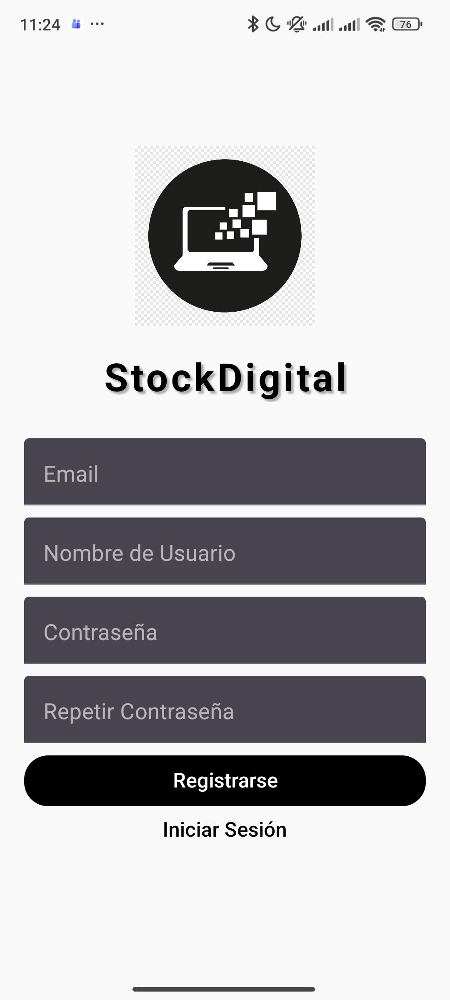

Perfecto. Ya entendí:
➡️ **Tu proyecto NO es un clon de Instagram**, sino un **sistema de inventario / stock tecnológico**, con login, CRUD de productos y selección de íconos tecnológicos.

Aquí tienes tu **README actualizado**, ya corregido, renombrado y adaptado al contexto REAL de tu app, **incluyendo las 4 imágenes de la carpeta `/images`**.

Este README ya está listo para copiarse en GitHub y mostrar correctamente las capturas.

---

# 📦 **StockTech — Sistema de Inventario Tecnológico (React Native + Firebase)**

## 📌 **Descripción del Proyecto**

**StockTech** es una aplicación móvil creada con **React Native (Expo)** que permite gestionar inventario tecnológico de forma sencilla.
Incluye autenticación, edición de perfil y un sistema completo de productos con precio, stock e íconos representativos.

### 🚀 Funciones principales

* **Autenticación con Firebase**

  * Registro
  * Inicio de sesión
  * Persistencia de sesión con AsyncStorage

* **Gestión de productos**

  * Agregar producto
  * Editar producto
  * Eliminar producto
  * Íconos de tecnología (CPU, smartphone, printer, monitor, etc.)
  * Vista tipo grilla de productos

* **Perfil del usuario**

  * Editar nombre de usuario
  * Datos guardados en Firebase Realtime Database

### 🧱 Tecnologías utilizadas

* React Native + Expo
* React Native Paper
* Firebase Authentication
* Firebase Realtime Database
* Firebase Storage (preparado)
* AsyncStorage

---

# 📸 **Capturas de pantalla**

<p float="left">
  
  
  
  
</p>

---

# ⚙️ **Cómo funciona**

## 🔐 Autenticación

* Al abrir la app se verifica si el usuario está logeado.
* Si *sí*, se muestra la pantalla principal con el inventario.
* Si *no*, se muestra `Auth.jsx` donde puedes:

  * Iniciar sesión
  * Registrarte

## 🛒 Gestión de inventario

Desde la pantalla principal puedes:

✔ **Agregar productos** (nombre, precio, stock, ícono)
✔ **Editar productos existentes**
✔ **Eliminar productos**
✔ **Visualizar productos en cuadrícula**

Los datos se guardan en Firebase bajo:

```
users/{uid}/images[]
```

---

# 🚀 **Cómo correr el proyecto**

### Requisitos

* Node.js
* Expo CLI:

```bash
npm install -g expo-cli
```

* Tener configurado tu proyecto Firebase

### Instalación

```bash
npm install
```

### Ejecutar la app

```bash
npx expo start
```

* Escanear con **Expo Go** o usar un emulador.

---

# 🔥 **Configuración de Firebase**

En `firebaseConfig.js`:

```javascript
const firebaseConfig = {
  apiKey: "...",
  authDomain: "...",
  databaseURL: "...",
  projectId: "...",
  storageBucket: "...",
  messagingSenderId: "...",
  appId: "...",
};
```

---

# 📂 **Estructura del Proyecto**

```
src/
  components/
    AddProductModal.jsx
    EditProfileModal.jsx
    ProductActionModal.jsx
    LoginForm.jsx
    RegisterForm.jsx

  screens/
    Auth.jsx
    Home.jsx

  styles/
    authStyles.js
    homeStyles.js
    modalStyles.js

  firebaseConfig.js

App.js
```

---

# 🛠 **Compilación con EAS**

La app está lista para build con:

```bash
eas build -p android
```

Con configuración en `eas.json`.

---

